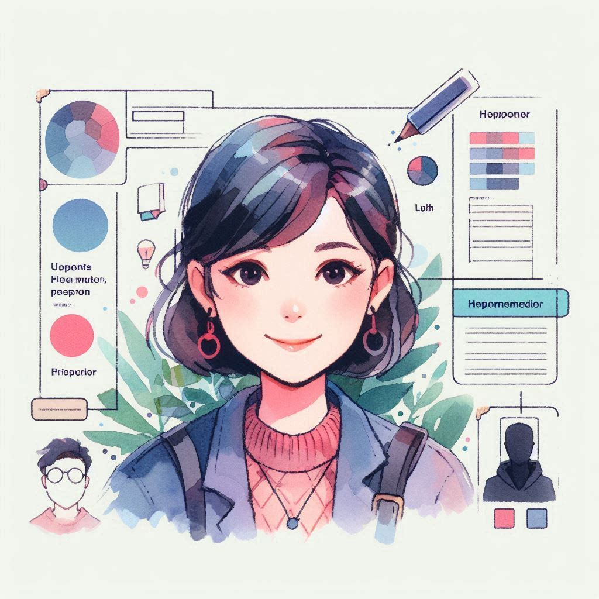
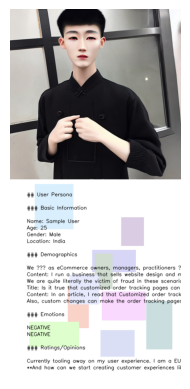

# Reddit Persona Generator
The Reddit Persona Generator is a Python script that combines Reddit data, sentiment analysis, and Stable Diffusion to create a personalized user persona image. This project fetches Reddit posts, processes the data to extract demographics, emotions, and opinions, and then generates an image with the persona details overlayed.

## Installation
## Clone the Repository:

`
git clone <repository_url>
cd <repository_directory>`

## Set Up Your Environment:

Ensure you have Python 3.8 or later installed. Create a virtual environment and install the required packages:

`python -m venv env`
source env/bin/activate  
- On Windows use: env\Scripts\activate
`pip install -r requirements.txt`
If requirements.txt is not available, manually install the dependencies:
`
pip install opencv-python numpy Pillow asyncio praw nest_asyncio transformers diffusers torch matplotlib`
Configuration
Reddit API Credentials:

Update the script with your Reddit API credentials. Replace the placeholders in the praw.Reddit initialization:
`
reddit = praw.Reddit(
    client_id="your_client_id",
    client_secret="your_client_secret",
    user_agent="your_user_agent",
)
`
Obtain these credentials by creating an application on Reddit's developer site.

- Usage
- Run the Script:

To execute the script and generate the user persona image, run:

`python script.py`
If you are using an IDE or notebook environment, ensure asynchronous code is properly executed. For Jupyter notebooks, use:
`
import nest_asyncio
nest_asyncio.apply()
await main()
`
Customize Parameters (Optional):

Subreddit and Keyword: Modify subreddit_name and keyword in the generate_persona_text function to target different subreddits or search for different keywords:
`
subreddit_name = "ecommerce"  # Change to desired subreddit
keyword = "customer experience"  # Change to desired keyword
Text Prompt for Image Generation: Update text_prompt in the main function to change the image characteristics:
text_prompt = "A young Chinese male with a clear, detailed, and beautiful face..."
View and Save the Output:
`

The script will display the generated image with persona text and save it as persona_image_with_text.png in the current directory. Open this file to view the final output.

## Functions
### fetch_reddit_data(subreddit_name, keyword, limit=10)
Fetches Reddit posts from a specified subreddit containing a keyword.

-Parameters:

subreddit_name (str): The name of the subreddit to search.
keyword (str): The keyword to search for in the subreddit posts.
limit (int): The maximum number of posts to fetch. Defaults to 10.
- Returns:

reddit_data (str): A string containing titles and content of the fetched Reddit posts.
- Usage:

reddit_data = await fetch_reddit_data("ecommerce", "customer experience", limit=10)
### refine_text_with_gpt2(text)
Uses GPT-2 to refine and enhance the extracted text.

- Parameters:

text (str): The text to be refined and enhanced.
- Returns:

refined_text (str): The GPT-2 refined version of the input text.
- Usage:

refined_text = refine_text_with_gpt2("Sample text to refine.")
extract_and_refine_insights(reddit_data)
Processes Reddit data to extract demographics, emotions, and ratings, then refines this information.

- Parameters:

reddit_data (str): The raw Reddit data to process.
- Returns:

refined_demographics (str): Refined text related to demographics.
refined_emotions (str): Refined text related to emotions.
refined_ratings (str): Refined text related to ratings.
- Usage:

demographics, emotions, ratings = await extract_and_refine_insights(reddit_data)
generate_persona_text()
Fetches Reddit data, processes it, and formats the user persona text.

- Returns:

persona_text (str): Formatted text containing user persona details including basic information, demographics, emotions, and ratings.
- Usage:

persona_text = await generate_persona_text()
create_persona_image(text_prompt)
### Generates an image based on a text prompt using Stable Diffusion.

- Parameters:

text_prompt (str): The text prompt to generate the image.
- Returns:

image_cv2 (numpy.ndarray): The generated image in OpenCV format.
- Usage:

image = create_persona_image("A young Chinese male with a clear, detailed, and beautiful face.")
create_canvas_with_text(image, persona_text)
### Creates a canvas, places the generated image, overlays random shapes, and adds persona text.

- Parameters:

image (numpy.ndarray): The image to place on the canvas.
persona_text (str): The text to overlay on the canvas.
Returns:

canvas (numpy.ndarray): The final canvas with the image, shapes, and text.
- Usage:

canvas_with_text = create_canvas_with_text(image, persona_text

## Results

## License
This project is licensed under the MIT License. See the LICENSE file for details.

## Acknowledgments
- Stable Diffusion for image generation.
- GPT-2 for text refinement.
- PRAW for Reddit API interaction.
- Transformers for sentiment analysis.
- OpenCV for image processing.

